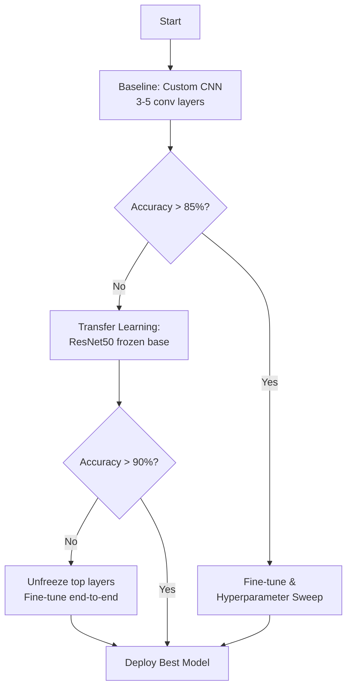
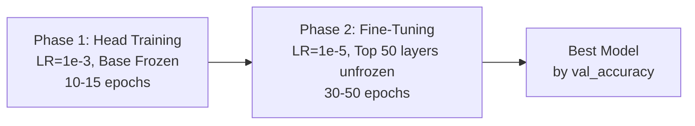
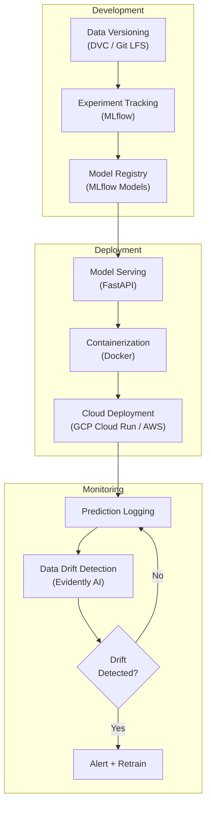
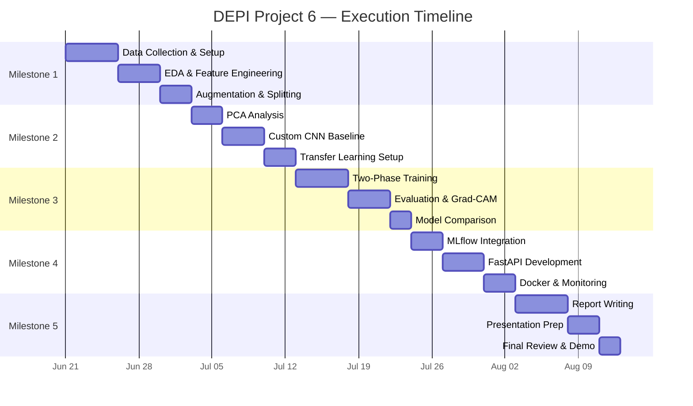

# 🛰️ DEPI Project 6: Land Type Classification Using Sentinel-2 Satellite Images

## Complete Project Execution Plan & Roadmap

> **Program**: Digital Egypt Pioneers Initiative (DEPI)  
> **Objective**: Build a Deep Neural Network (DNN/CNN) to classify land types — Agriculture, Water, Urban, Desert, Roads, Trees — from ESA Sentinel-2 multispectral satellite imagery.  
> **Date**: June 2026

---

## Architecture Overview


---

# Milestone 1 — Data Collection, Exploration & Preprocessing

## 1.1 Conceptual Methodology

Sentinel-2 satellites capture Earth imagery across **13 spectral bands** at varying spatial resolutions (10m, 20m, 60m). For land-type classification, the most discriminative bands are:

| Band | Name | Resolution | Use Case |
|------|------|-----------|----------|
| B2 | Blue | 10m | Water detection, atmospheric correction |
| B3 | Green | 10m | Vegetation vigor |
| B4 | Red | 10m | Chlorophyll absorption |
| B8 | NIR | 10m | Vegetation structure, NDVI |
| B11 | SWIR-1 | 20m | Moisture content, urban materials |
| B12 | SWIR-2 | 20m | Soil/mineral discrimination |

**Data Sourcing Options (ranked by practicality):**

1. **EuroSAT Dataset (Recommended for DEPI)**: Pre-labeled, 27,000 geo-referenced Sentinel-2 patches (64×64 px), 10 LULC classes. Available on [Zenodo](https://zenodo.org/record/7711810) or via `torchvision.datasets.EuroSAT`. This eliminates manual labeling and lets you focus on modeling.
2. **Copernicus Data Space Ecosystem** (`dataspace.copernicus.eu`): Free programmatic access to raw Sentinel-2 L2A (atmospherically corrected) tiles. Requires manual patch extraction and labeling.
3. **USGS Earth Explorer** (`earthexplorer.usgs.gov`): Alternative portal, same Sentinel-2 archive, USGS account required.
4. **Google Earth Engine (GEE)**: Cloud-based processing of petabytes of satellite data. Best for large-scale regional analysis of Egypt.

> [!TIP]
> **For your DEPI project**, start with EuroSAT for rapid prototyping and model development. Once your pipeline is validated, demonstrate the ability to process raw Sentinel-2 tiles for Egyptian regions as a bonus deliverable.

## 1.2 Task Checklist

- [ ] Download and organize the EuroSAT dataset (RGB or multispectral variant)
- [ ] Set up project directory structure (`data/raw/`, `data/processed/`, `models/`, `notebooks/`, `src/`)
- [ ] Read and visualize multispectral bands using `rasterio`
- [ ] Compute NDVI and other spectral indices (NDWI, NDBI)
- [ ] Perform exploratory data analysis: class distribution, pixel histograms, band correlations
- [ ] Implement data augmentation pipeline (rotations, flips, color jitter)
- [ ] Split data into Train (70%) / Validation (15%) / Test (15%) with stratification
- [ ] Create `tf.data.Dataset` or PyTorch `DataLoader` pipelines with prefetching
- [ ] Document all preprocessing decisions and rationale

## 1.3 Code Blueprint

### 1.3.1 Project Directory Structure

```
sentinel2-land-classification/
├── data/
│   ├── raw/                    # Original EuroSAT or Sentinel-2 downloads
│   ├── processed/              # Preprocessed patches, NDVI arrays
│   └── splits/                 # train/val/test CSVs
├── notebooks/
│   ├── 01_eda.ipynb
│   ├── 02_pca_analysis.ipynb
│   ├── 03_model_training.ipynb
│   └── 04_evaluation.ipynb
├── src/
│   ├── __init__.py
│   ├── data_loading.py
│   ├── preprocessing.py
│   ├── feature_engineering.py
│   ├── model.py
│   ├── train.py
│   ├── evaluate.py
│   └── inference.py
├── api/
│   ├── main.py                 # FastAPI application
│   └── schemas.py
├── mlruns/                     # MLflow experiment logs
├── configs/
│   └── config.yaml
├── requirements.txt
├── Dockerfile
└── README.md
```

### 1.3.2 Reading & Visualizing Multispectral Bands

```python
"""
src/data_loading.py
Reading Sentinel-2 multispectral imagery using rasterio and OpenCV.
"""
import numpy as np
import rasterio
from rasterio.plot import show
import matplotlib.pyplot as plt
from pathlib import Path
import cv2


def load_sentinel2_tif(filepath: str) -> tuple[np.ndarray, dict]:
    """
    Load a Sentinel-2 GeoTIFF file and return the band array + metadata.
    
    Args:
        filepath: Path to .tif file (e.g., EuroSAT multispectral patch)
    
    Returns:
        bands: np.ndarray of shape (C, H, W) — channels-first
        meta: rasterio metadata dict (CRS, transform, etc.)
    """
    with rasterio.open(filepath) as src:
        bands = src.read()          # Shape: (num_bands, height, width)
        meta = src.meta.copy()
        profile = src.profile
    
    print(f"[INFO] Loaded {filepath}")
    print(f"       Shape: {bands.shape}, Dtype: {bands.dtype}")
    print(f"       CRS: {meta.get('crs')}, Bounds: {src.bounds}")
    
    return bands, meta


def visualize_rgb_composite(bands: np.ndarray, 
                            rgb_indices: tuple = (3, 2, 1),
                            title: str = "True Color Composite") -> None:
    """
    Display a true-color or false-color composite from multispectral bands.
    
    Args:
        bands: (C, H, W) array of spectral bands
        rgb_indices: Tuple of (R, G, B) band indices (0-based).
                     For EuroSAT 13-band: True color = (3, 2, 1), 
                     False color (NIR) = (7, 3, 2)
        title: Plot title
    """
    rgb = np.stack([bands[i] for i in rgb_indices], axis=-1).astype(np.float32)
    
    # Percentile-based contrast stretch for visualization
    p2, p98 = np.percentile(rgb, (2, 98))
    rgb_stretched = np.clip((rgb - p2) / (p98 - p2 + 1e-10), 0, 1)
    
    fig, axes = plt.subplots(1, 2, figsize=(14, 6))
    axes[0].imshow(rgb_stretched)
    axes[0].set_title(title)
    axes[0].axis("off")
    
    # Show individual band histograms
    colors = ['red', 'green', 'blue']
    for i, (idx, color) in enumerate(zip(rgb_indices, colors)):
        axes[1].hist(bands[idx].ravel(), bins=100, color=color, 
                     alpha=0.5, label=f"Band {idx}")
    axes[1].set_title("Pixel Value Distribution per Band")
    axes[1].set_xlabel("Pixel Value (DN)")
    axes[1].set_ylabel("Frequency")
    axes[1].legend()
    
    plt.tight_layout()
    plt.savefig("outputs/rgb_composite.png", dpi=150, bbox_inches="tight")
    plt.show()


def load_eurosat_rgb(data_dir: str, class_name: str, index: int = 0) -> np.ndarray:
    """
    Load an RGB EuroSAT image by class name and index.
    EuroSAT RGB images are standard JPEG files organized by class folder.
    """
    class_dir = Path(data_dir) / class_name
    images = sorted(class_dir.glob("*.jpg"))
    
    if index >= len(images):
        raise IndexError(f"Only {len(images)} images in class '{class_name}'")
    
    img = cv2.imread(str(images[index]))
    img = cv2.cvtColor(img, cv2.COLOR_BGR2RGB)  # OpenCV loads as BGR
    return img
```

### 1.3.3 Feature Engineering — Spectral Indices

```python
"""
src/feature_engineering.py
Compute spectral indices from Sentinel-2 bands for enhanced land-type discrimination.
"""
import numpy as np


def compute_ndvi(nir: np.ndarray, red: np.ndarray) -> np.ndarray:
    """
    Normalized Difference Vegetation Index (NDVI).
    NDVI = (NIR - Red) / (NIR + Red)
    
    Values range from -1 to +1:
      - High NDVI (0.6–0.9): Dense vegetation (trees, healthy crops)
      - Moderate NDVI (0.2–0.5): Sparse vegetation, agriculture
      - Low/Negative NDVI (<0.1): Water, urban, desert, bare soil
    
    Args:
        nir: Near-Infrared band array (Band 8 in Sentinel-2, 10m resolution)
        red: Red band array (Band 4 in Sentinel-2, 10m resolution)
    
    Returns:
        NDVI array with same spatial dimensions, values in [-1, 1]
    """
    nir = nir.astype(np.float32)
    red = red.astype(np.float32)
    
    denominator = nir + red
    ndvi = np.where(
        denominator == 0,
        0.0,
        (nir - red) / denominator
    )
    return np.clip(ndvi, -1.0, 1.0)


def compute_ndwi(green: np.ndarray, nir: np.ndarray) -> np.ndarray:
    """
    Normalized Difference Water Index (NDWI).
    NDWI = (Green - NIR) / (Green + NIR)
    
    Highlights water bodies: high values indicate open water surfaces.
    """
    green = green.astype(np.float32)
    nir = nir.astype(np.float32)
    denominator = green + nir
    ndwi = np.where(denominator == 0, 0.0, (green - nir) / denominator)
    return np.clip(ndwi, -1.0, 1.0)


def compute_ndbi(swir: np.ndarray, nir: np.ndarray) -> np.ndarray:
    """
    Normalized Difference Built-up Index (NDBI).
    NDBI = (SWIR - NIR) / (SWIR + NIR)
    
    Highlights urban/built-up areas: positive values indicate impervious surfaces.
    Uses Band 11 (SWIR-1, 1610nm) and Band 8 (NIR, 842nm).
    """
    swir = swir.astype(np.float32)
    nir = nir.astype(np.float32)
    denominator = swir + nir
    ndbi = np.where(denominator == 0, 0.0, (swir - nir) / denominator)
    return np.clip(ndbi, -1.0, 1.0)


def create_spectral_feature_stack(bands: np.ndarray,
                                   band_mapping: dict = None) -> np.ndarray:
    """
    Create an enriched feature stack by appending spectral indices to raw bands.
    
    Args:
        bands: (C, H, W) multispectral array
        band_mapping: Dict mapping band names to indices.
                      Default assumes EuroSAT 13-band ordering:
                      {'B2':0, 'B3':1, 'B4':2, 'B5':3, 'B6':4, 'B7':5,
                       'B8':6, 'B8A':7, 'B9':8, 'B10':9, 'B11':10, 'B12':11, 'B1':12}
    
    Returns:
        Enhanced (C+3, H, W) array with NDVI, NDWI, NDBI appended
    """
    if band_mapping is None:
        band_mapping = {
            'red': 2,    # B4
            'green': 1,  # B3
            'nir': 6,    # B8
            'swir': 10   # B11
        }
    
    ndvi = compute_ndvi(bands[band_mapping['nir']], bands[band_mapping['red']])
    ndwi = compute_ndwi(bands[band_mapping['green']], bands[band_mapping['nir']])
    ndbi = compute_ndbi(bands[band_mapping['swir']], bands[band_mapping['nir']])
    
    # Stack: original bands + 3 spectral indices
    enriched = np.concatenate([
        bands,
        ndvi[np.newaxis, ...],
        ndwi[np.newaxis, ...],
        ndbi[np.newaxis, ...]
    ], axis=0)
    
    print(f"[INFO] Feature stack: {bands.shape[0]} bands + 3 indices = "
          f"{enriched.shape[0]} channels")
    return enriched


# ── Visualization ──────────────────────────────────────────────────

def plot_spectral_indices(bands: np.ndarray, band_mapping: dict = None):
    """Visualize NDVI, NDWI, NDBI side by side."""
    import matplotlib.pyplot as plt
    
    if band_mapping is None:
        band_mapping = {'red': 2, 'green': 1, 'nir': 6, 'swir': 10}
    
    ndvi = compute_ndvi(bands[band_mapping['nir']], bands[band_mapping['red']])
    ndwi = compute_ndwi(bands[band_mapping['green']], bands[band_mapping['nir']])
    ndbi = compute_ndbi(bands[band_mapping['swir']], bands[band_mapping['nir']])
    
    fig, axes = plt.subplots(1, 3, figsize=(18, 5))
    
    indices = [("NDVI", ndvi, "RdYlGn"), ("NDWI", ndwi, "RdBu"), ("NDBI", ndbi, "YlOrRd")]
    for ax, (name, data, cmap) in zip(axes, indices):
        im = ax.imshow(data, cmap=cmap, vmin=-1, vmax=1)
        ax.set_title(f"{name}", fontsize=14, fontweight="bold")
        ax.axis("off")
        plt.colorbar(im, ax=ax, fraction=0.046, pad=0.04)
    
    plt.suptitle("Spectral Indices for Land Type Discrimination", fontsize=16)
    plt.tight_layout()
    plt.savefig("outputs/spectral_indices.png", dpi=150)
    plt.show()
```

### 1.3.4 Data Augmentation & Splitting

```python
"""
src/preprocessing.py
Data augmentation, normalization, and train/val/test splitting.
"""
import numpy as np
import albumentations as A
from albumentations.pytorch import ToTensorV2
import tensorflow as tf
from sklearn.model_selection import train_test_split
from pathlib import Path
import pandas as pd


# ── Class Mapping ──────────────────────────────────────────────────

# Map EuroSAT classes to our 6 target land types
EUROSAT_TO_TARGET = {
    "AnnualCrop": "Agriculture",
    "PermanentCrop": "Agriculture",
    "Pasture": "Agriculture",
    "Forest": "Trees",
    "HerbaceousVegetation": "Trees",
    "River": "Water",
    "SeaLake": "Water",
    "Residential": "Urban",
    "Industrial": "Urban",
    "Highway": "Roads",
    # Note: EuroSAT doesn't have a "Desert" class.
    # For Egypt, supplement with Sentinel-2 patches from arid regions.
}

CLASS_NAMES = ["Agriculture", "Water", "Urban", "Desert", "Roads", "Trees"]
NUM_CLASSES = len(CLASS_NAMES)


# ── Albumentations Augmentation Pipeline ───────────────────────────

def get_train_augmentation(image_size: int = 64) -> A.Compose:
    """
    Training augmentation pipeline using Albumentations.
    Satellite images are rotation-invariant, so aggressive geometric
    transforms are appropriate.
    """
    return A.Compose([
        A.RandomRotate90(p=0.5),
        A.HorizontalFlip(p=0.5),
        A.VerticalFlip(p=0.5),
        A.ShiftScaleRotate(
            shift_limit=0.1,
            scale_limit=0.15,
            rotate_limit=45,
            border_mode=0,  # cv2.BORDER_CONSTANT
            p=0.5
        ),
        A.RandomBrightnessContrast(
            brightness_limit=0.2,
            contrast_limit=0.2,
            p=0.3
        ),
        A.GaussNoise(var_limit=(10.0, 50.0), p=0.2),
        A.Resize(image_size, image_size),
        A.Normalize(
            mean=[0.485, 0.456, 0.406],   # ImageNet stats for RGB
            std=[0.229, 0.224, 0.225],
        ),
        ToTensorV2(),
    ])


def get_val_augmentation(image_size: int = 64) -> A.Compose:
    """Validation/test pipeline — only resize and normalize, no augmentation."""
    return A.Compose([
        A.Resize(image_size, image_size),
        A.Normalize(
            mean=[0.485, 0.456, 0.406],
            std=[0.229, 0.224, 0.225],
        ),
        ToTensorV2(),
    ])


# ── TensorFlow Data Pipeline ──────────────────────────────────────

def tf_augmentation_layer(image_size: int = 64) -> tf.keras.Sequential:
    """
    TensorFlow-native augmentation using Keras preprocessing layers.
    Alternative to Albumentations for TF-only pipelines.
    """
    return tf.keras.Sequential([
        tf.keras.layers.Resizing(image_size, image_size),
        tf.keras.layers.RandomFlip("horizontal_and_vertical"),
        tf.keras.layers.RandomRotation(0.25),
        tf.keras.layers.RandomZoom(0.1),
        tf.keras.layers.RandomContrast(0.2),
    ], name="augmentation")


# ── Stratified Train/Val/Test Split ───────────────────────────────

def create_stratified_splits(
    data_dir: str,
    output_dir: str = "data/splits",
    train_ratio: float = 0.70,
    val_ratio: float = 0.15,
    test_ratio: float = 0.15,
    random_state: int = 42
) -> tuple[pd.DataFrame, pd.DataFrame, pd.DataFrame]:
    """
    Create stratified train/val/test splits from a class-organized directory.
    
    Expected directory structure:
        data_dir/
            Agriculture/  img001.jpg, img002.jpg, ...
            Water/        img001.jpg, ...
            Urban/        ...
    
    Returns:
        Three DataFrames (train_df, val_df, test_df) with columns:
        ['filepath', 'class_name', 'label']
    """
    assert abs(train_ratio + val_ratio + test_ratio - 1.0) < 1e-6
    
    records = []
    data_path = Path(data_dir)
    
    for class_idx, class_name in enumerate(sorted(data_path.iterdir())):
        if not class_name.is_dir():
            continue
        for img_path in class_name.glob("*.*"):
            records.append({
                "filepath": str(img_path),
                "class_name": class_name.name,
                "label": class_idx
            })
    
    df = pd.DataFrame(records)
    print(f"[INFO] Total samples: {len(df)}")
    print(f"       Class distribution:\n{df['class_name'].value_counts().to_string()}\n")
    
    # First split: train vs (val + test)
    train_df, temp_df = train_test_split(
        df, test_size=(val_ratio + test_ratio),
        stratify=df["label"], random_state=random_state
    )
    
    # Second split: val vs test
    relative_test_ratio = test_ratio / (val_ratio + test_ratio)
    val_df, test_df = train_test_split(
        temp_df, test_size=relative_test_ratio,
        stratify=temp_df["label"], random_state=random_state
    )
    
    # Save splits
    output_path = Path(output_dir)
    output_path.mkdir(parents=True, exist_ok=True)
    train_df.to_csv(output_path / "train.csv", index=False)
    val_df.to_csv(output_path / "val.csv", index=False)
    test_df.to_csv(output_path / "test.csv", index=False)
    
    print(f"[INFO] Split sizes — Train: {len(train_df)}, "
          f"Val: {len(val_df)}, Test: {len(test_df)}")
    
    return train_df, val_df, test_df


# ── EDA: Pixel Distribution Histograms ────────────────────────────

def plot_class_pixel_distributions(data_dir: str, num_samples: int = 50):
    """
    Plot pixel value distributions per class to understand radiometric signatures.
    This reveals if classes are separable in raw pixel space.
    """
    import matplotlib.pyplot as plt
    from PIL import Image
    
    data_path = Path(data_dir)
    classes = sorted([d.name for d in data_path.iterdir() if d.is_dir()])
    
    fig, axes = plt.subplots(2, 3, figsize=(18, 10))
    axes = axes.ravel()
    
    for idx, class_name in enumerate(classes[:6]):
        class_dir = data_path / class_name
        images = list(class_dir.glob("*.jpg"))[:num_samples]
        
        all_pixels = []
        for img_path in images:
            img = np.array(Image.open(img_path))
            all_pixels.append(img)
        
        pixels = np.concatenate([p.reshape(-1, 3) for p in all_pixels], axis=0)
        
        for c, color in enumerate(['red', 'green', 'blue']):
            axes[idx].hist(pixels[:, c], bins=50, color=color, 
                          alpha=0.4, density=True, label=color.upper())
        
        axes[idx].set_title(f"{class_name}", fontsize=12, fontweight="bold")
        axes[idx].set_xlabel("Pixel Value")
        axes[idx].legend(fontsize=8)
    
    plt.suptitle("Pixel Value Distributions by Land Type Class", fontsize=16)
    plt.tight_layout()
    plt.savefig("outputs/pixel_distributions.png", dpi=150)
    plt.show()
```

---

# Milestone 2 — Advanced Data Analysis & Model Selection

## 2.1 Conceptual Methodology

### Dimensionality Reduction with PCA

Sentinel-2's 13 bands create high-dimensional feature spaces where many bands are correlated (e.g., B5–B7 vegetation red-edge bands). **Principal Component Analysis (PCA)** decorrelates these bands and identifies the axes of maximum variance:

- **PC1** typically captures overall scene brightness (~60–70% variance)
- **PC2** separates vegetation from non-vegetation (~15–20%)
- **PC3** distinguishes water from land (~5–10%)

PCA serves two purposes: (1) dimensionality reduction for classical ML baselines, and (2) data visualization to verify class separability before committing to deep learning.

### Model Selection Strategy



| Model | Params | Pros | Cons |
|-------|--------|------|------|
| Custom CNN (3-layer) | ~500K | Fast training, interpretable, good baseline | May underfit complex textures |
| VGG16 | 138M | Simple architecture, proven on image tasks | Very heavy, slow inference |
| ResNet50 | 25.6M | Skip connections prevent vanishing gradients, strong ImageNet features | Requires input resizing to 224×224 |
| EfficientNetB0 | 5.3M | Best accuracy/parameter ratio, compound scaling | More complex training dynamics |

> [!IMPORTANT]
> **Recommended approach**: Start with a **Custom 5-layer CNN** as baseline, then move to **ResNet50 with frozen base + custom head** for transfer learning. ResNet50 provides the best balance of accuracy and computational efficiency for 64×64 satellite patches resized to 224×224.

## 2.2 Task Checklist

- [ ] Reshape multispectral pixel data for PCA (flatten spatial dims)
- [ ] Fit PCA on training set, transform all splits, plot explained variance
- [ ] Visualize first 3 principal components as false-color composite
- [ ] Build and train a Custom CNN baseline (3–5 conv blocks)
- [ ] Implement ResNet50 transfer learning pipeline with frozen base
- [ ] Implement EfficientNetB0 as an additional comparison
- [ ] Create a model comparison table (accuracy, F1, params, inference time)
- [ ] Select best architecture for full training in Milestone 3

## 2.3 Code Blueprint

### 2.3.1 PCA on Multispectral Pixel Data

```python
"""
src/pca_analysis.py
Dimensionality reduction and visualization of multispectral satellite data.
"""
import numpy as np
from sklearn.decomposition import PCA
from sklearn.preprocessing import StandardScaler
import matplotlib.pyplot as plt


def apply_pca_to_multispectral(
    bands: np.ndarray,
    n_components: int = 3,
    sample_fraction: float = 0.1
) -> tuple[np.ndarray, PCA, StandardScaler]:
    """
    Apply PCA to multispectral image data for dimensionality reduction.
    
    Args:
        bands: (C, H, W) multispectral array — C spectral bands
        n_components: Number of principal components to retain
        sample_fraction: Fraction of pixels to use for fitting (memory-efficient)
    
    Returns:
        pca_image: (n_components, H, W) PCA-transformed image
        pca_model: Fitted PCA object
        scaler: Fitted StandardScaler
    """
    C, H, W = bands.shape
    
    # Reshape: (C, H, W) → (H*W, C) — each pixel is a sample with C features
    pixels = bands.reshape(C, -1).T  # Shape: (H*W, C)
    
    # Standardize features (zero mean, unit variance)
    scaler = StandardScaler()
    pixels_scaled = scaler.fit_transform(pixels.astype(np.float64))
    
    # Subsample for fitting efficiency on large images
    n_pixels = pixels_scaled.shape[0]
    sample_size = int(n_pixels * sample_fraction)
    rng = np.random.default_rng(42)
    sample_idx = rng.choice(n_pixels, size=sample_size, replace=False)
    
    # Fit PCA on subsample, transform all pixels
    pca = PCA(n_components=n_components, random_state=42)
    pca.fit(pixels_scaled[sample_idx])
    pixels_pca = pca.transform(pixels_scaled)  # (H*W, n_components)
    
    # Reshape back to image: (n_components, H, W)
    pca_image = pixels_pca.T.reshape(n_components, H, W)
    
    return pca_image, pca, scaler


def plot_pca_results(pca_image: np.ndarray, pca_model: PCA):
    """Visualize PCA components and explained variance."""
    fig, axes = plt.subplots(1, 4, figsize=(22, 5))
    
    # Plot first 3 PCs as grayscale images
    for i in range(min(3, pca_image.shape[0])):
        pc = pca_image[i]
        pc_norm = (pc - pc.min()) / (pc.max() - pc.min() + 1e-10)
        axes[i].imshow(pc_norm, cmap='viridis')
        axes[i].set_title(
            f"PC{i+1} ({pca_model.explained_variance_ratio_[i]*100:.1f}%)",
            fontsize=13, fontweight='bold'
        )
        axes[i].axis('off')
    
    # Explained variance cumulative plot
    cumvar = np.cumsum(pca_model.explained_variance_ratio_) * 100
    axes[3].bar(range(1, len(cumvar) + 1), 
                pca_model.explained_variance_ratio_ * 100,
                color='steelblue', alpha=0.7, label='Individual')
    axes[3].plot(range(1, len(cumvar) + 1), cumvar, 
                 'ro-', label='Cumulative')
    axes[3].set_xlabel('Principal Component')
    axes[3].set_ylabel('Explained Variance (%)')
    axes[3].set_title('Explained Variance Ratio')
    axes[3].legend()
    axes[3].set_xticks(range(1, len(cumvar) + 1))
    
    plt.suptitle("PCA Decomposition of Multispectral Bands", fontsize=16)
    plt.tight_layout()
    plt.savefig("outputs/pca_analysis.png", dpi=150)
    plt.show()


def pca_for_dataset_features(
    images: np.ndarray,
    labels: np.ndarray,
    n_components: int = 50
) -> tuple[np.ndarray, PCA]:
    """
    Apply PCA to flatten image datasets for classical ML baselines.
    
    Args:
        images: (N, H, W, C) array of image patches
        labels: (N,) array of class labels
        n_components: Number of components to retain
    
    Returns:
        features: (N, n_components) reduced feature matrix
        pca: Fitted PCA model
    """
    N = images.shape[0]
    flat = images.reshape(N, -1).astype(np.float32)
    
    scaler = StandardScaler()
    flat_scaled = scaler.fit_transform(flat)
    
    pca = PCA(n_components=n_components, random_state=42)
    features = pca.fit_transform(flat_scaled)
    
    total_var = sum(pca.explained_variance_ratio_) * 100
    print(f"[INFO] PCA: {n_components} components explain {total_var:.1f}% of variance")
    
    return features, pca
```

### 2.3.2 Custom CNN Baseline

```python
"""
src/model.py
Model architectures: Custom CNN baseline and Transfer Learning with ResNet50.
"""
import tensorflow as tf
from tensorflow import keras
from tensorflow.keras import layers, Model


def build_custom_cnn(
    input_shape: tuple = (64, 64, 3),
    num_classes: int = 6,
    dropout_rate: float = 0.4
) -> keras.Model:
    """
    Custom CNN baseline for land-type classification.
    Architecture: 4 Conv blocks → GlobalAvgPool → Dense head.
    
    Design rationale:
    - BatchNorm after each conv for stable training
    - Increasing filter sizes (32→64→128→256) capture hierarchical features
    - GlobalAveragePooling instead of Flatten reduces overfitting
    - ~1.2M parameters — suitable for 64×64 patches
    """
    inputs = keras.Input(shape=input_shape, name="input_image")
    
    # Block 1: Edge and texture detection
    x = layers.Conv2D(32, 3, padding="same", activation="relu", name="conv1")(inputs)
    x = layers.BatchNormalization()(x)
    x = layers.Conv2D(32, 3, padding="same", activation="relu", name="conv1b")(x)
    x = layers.BatchNormalization()(x)
    x = layers.MaxPooling2D(2)(x)
    
    # Block 2: Low-level patterns (roads, water edges)
    x = layers.Conv2D(64, 3, padding="same", activation="relu", name="conv2")(x)
    x = layers.BatchNormalization()(x)
    x = layers.Conv2D(64, 3, padding="same", activation="relu", name="conv2b")(x)
    x = layers.BatchNormalization()(x)
    x = layers.MaxPooling2D(2)(x)
    
    # Block 3: Mid-level features (building patterns, crop rows)
    x = layers.Conv2D(128, 3, padding="same", activation="relu", name="conv3")(x)
    x = layers.BatchNormalization()(x)
    x = layers.MaxPooling2D(2)(x)
    
    # Block 4: High-level semantic features
    x = layers.Conv2D(256, 3, padding="same", activation="relu", name="conv4")(x)
    x = layers.BatchNormalization()(x)
    x = layers.GlobalAveragePooling2D(name="global_avg_pool")(x)
    
    # Classification head
    x = layers.Dense(256, activation="relu", name="fc1")(x)
    x = layers.Dropout(dropout_rate)(x)
    x = layers.Dense(128, activation="relu", name="fc2")(x)
    x = layers.Dropout(dropout_rate)(x)
    outputs = layers.Dense(num_classes, activation="softmax", name="predictions")(x)
    
    model = keras.Model(inputs=inputs, outputs=outputs, name="CustomCNN_LandType")
    model.summary()
    return model


def build_resnet50_transfer(
    input_shape: tuple = (224, 224, 3),
    num_classes: int = 6,
    freeze_base: bool = True,
    fine_tune_from: int = 140
) -> keras.Model:
    """
    ResNet50 Transfer Learning for land-type classification.
    
    Strategy:
    1. Load ResNet50 pre-trained on ImageNet (no top classifier)
    2. Freeze all base layers initially
    3. Append custom classification head for 6 land types
    4. After initial training, optionally unfreeze top layers for fine-tuning
    
    Args:
        input_shape: Input dimensions (ResNet50 expects 224×224 minimum)
        num_classes: Number of land-type classes
        freeze_base: Whether to freeze base model weights
        fine_tune_from: Layer index from which to unfreeze (only if freeze_base=False)
    
    Returns:
        Compiled Keras model ready for training
    """
    # ── Load pre-trained base ──────────────────────────────────
    base_model = keras.applications.ResNet50(
        weights="imagenet",
        include_top=False,           # Remove ImageNet classification head
        input_shape=input_shape,
        pooling=None                 # We'll add our own pooling
    )
    
    # Freeze strategy
    if freeze_base:
        base_model.trainable = False
        print(f"[INFO] Base model frozen: {len(base_model.layers)} layers locked")
    else:
        # Partial fine-tuning: freeze early layers, unfreeze deeper ones
        base_model.trainable = True
        for layer in base_model.layers[:fine_tune_from]:
            layer.trainable = False
        trainable = sum(1 for l in base_model.layers if l.trainable)
        print(f"[INFO] Fine-tuning: {trainable} layers unfrozen "
              f"(from layer {fine_tune_from})")
    
    # ── Build classification head ──────────────────────────────
    inputs = keras.Input(shape=input_shape, name="input_image")
    
    # Preprocessing: scale pixels to [-1, 1] for ResNet
    x = keras.applications.resnet50.preprocess_input(inputs)
    
    # Feature extraction
    x = base_model(x, training=False)  # Keep BN in inference mode
    
    # Custom head
    x = layers.GlobalAveragePooling2D(name="global_avg_pool")(x)
    x = layers.Dense(512, activation="relu", name="fc1")(x)
    x = layers.BatchNormalization()(x)
    x = layers.Dropout(0.5, name="dropout1")(x)
    x = layers.Dense(256, activation="relu", name="fc2")(x)
    x = layers.Dropout(0.3, name="dropout2")(x)
    outputs = layers.Dense(num_classes, activation="softmax", name="predictions")(x)
    
    model = keras.Model(inputs=inputs, outputs=outputs, 
                        name="ResNet50_LandType")
    
    # Print trainable parameter count
    trainable_params = sum(
        tf.keras.backend.count_params(w) for w in model.trainable_weights
    )
    total_params = model.count_params()
    print(f"[INFO] Total params: {total_params:,}")
    print(f"[INFO] Trainable params: {trainable_params:,} "
          f"({trainable_params/total_params*100:.1f}%)")
    
    return model


# ── PyTorch Alternative ────────────────────────────────────────────

def build_resnet50_pytorch(num_classes: int = 6, freeze_base: bool = True):
    """
    PyTorch equivalent using torchvision's ResNet50.
    """
    import torch
    import torch.nn as nn
    from torchvision import models
    
    # Load pre-trained ResNet50
    weights = models.ResNet50_Weights.IMAGENET1K_V2
    base_model = models.resnet50(weights=weights)
    
    # Freeze base layers
    if freeze_base:
        for param in base_model.parameters():
            param.requires_grad = False
    
    # Replace the final fully connected layer
    num_features = base_model.fc.in_features  # 2048 for ResNet50
    base_model.fc = nn.Sequential(
        nn.Linear(num_features, 512),
        nn.ReLU(),
        nn.BatchNorm1d(512),
        nn.Dropout(0.5),
        nn.Linear(512, 256),
        nn.ReLU(),
        nn.Dropout(0.3),
        nn.Linear(256, num_classes)
    )
    
    # Unfreeze the new head
    for param in base_model.fc.parameters():
        param.requires_grad = True
    
    trainable = sum(p.numel() for p in base_model.parameters() if p.requires_grad)
    total = sum(p.numel() for p in base_model.parameters())
    print(f"[INFO] PyTorch ResNet50 — Trainable: {trainable:,} / {total:,} params")
    
    return base_model
```

---

# Milestone 3 — Model Development & Training

## 3.1 Conceptual Methodology

### Optimization Strategy

| Hyperparameter | Recommended Value | Rationale |
|---|---|---|
| **Optimizer** | AdamW | Weight decay decoupled from gradient update; better generalization than Adam |
| **Learning Rate (frozen)** | 1e-3 | Higher LR for randomly initialized head layers |
| **Learning Rate (fine-tune)** | 1e-5 | Much lower LR for pre-trained layers to avoid catastrophic forgetting |
| **Batch Size** | 32–64 | Balance between gradient noise and GPU memory; 64×64 patches fit easily |
| **Epochs** | 50–100 | With early stopping patience=10 |
| **LR Schedule** | ReduceLROnPlateau | Reduce by 0.5× when val_loss plateaus for 5 epochs |
| **Label Smoothing** | 0.1 | Prevents overconfident predictions, improves calibration |
| **Weight Decay** | 1e-4 | L2 regularization via AdamW |

### Two-Phase Training Protocol



> [!TIP]
> **Two-phase training** is critical for transfer learning. Training the head first ensures the randomly initialized classification layers converge before the pre-trained features are modified. Fine-tuning with a low learning rate then adapts the deep features to satellite imagery without destroying ImageNet representations.

## 3.2 Task Checklist

- [ ] Implement two-phase training loop (frozen → fine-tune)
- [ ] Configure AdamW optimizer with learning rate schedule
- [ ] Add Early Stopping (patience=10, monitor val_loss)
- [ ] Add Model Checkpointing (save best model by val_accuracy)
- [ ] Implement label smoothing in the loss function
- [ ] Train and log training curves (loss + accuracy per epoch)
- [ ] Generate Confusion Matrix on test set
- [ ] Generate Classification Report (Precision, Recall, F1 per class)
- [ ] Plot per-class ROC curves and compute AUC
- [ ] Implement Grad-CAM for model interpretability
- [ ] Compare baseline CNN vs. ResNet50 vs. EfficientNet results

## 3.3 Code Blueprint

### 3.3.1 Training Pipeline with Callbacks

```python
"""
src/train.py
End-to-end training pipeline with two-phase transfer learning.
"""
import tensorflow as tf
from tensorflow import keras
from tensorflow.keras import callbacks
import numpy as np
from pathlib import Path
import json
import datetime


def compile_model(
    model: keras.Model,
    learning_rate: float = 1e-3,
    label_smoothing: float = 0.1
) -> keras.Model:
    """
    Compile model with AdamW optimizer and label-smoothed cross-entropy.
    """
    optimizer = keras.optimizers.AdamW(
        learning_rate=learning_rate,
        weight_decay=1e-4,
        clipnorm=1.0    # Gradient clipping for stability
    )
    
    loss = keras.losses.CategoricalCrossentropy(
        label_smoothing=label_smoothing
    )
    
    model.compile(
        optimizer=optimizer,
        loss=loss,
        metrics=[
            "accuracy",
            keras.metrics.TopKCategoricalAccuracy(k=2, name="top2_accuracy"),
            keras.metrics.AUC(name="auc", multi_label=False),
        ]
    )
    
    print(f"[INFO] Compiled with lr={learning_rate}, "
          f"label_smoothing={label_smoothing}")
    return model


def get_callbacks(
    checkpoint_dir: str = "models/checkpoints",
    experiment_name: str = "land_classification"
) -> list:
    """
    Training callbacks for regularization and monitoring.
    """
    Path(checkpoint_dir).mkdir(parents=True, exist_ok=True)
    timestamp = datetime.datetime.now().strftime("%Y%m%d_%H%M%S")
    
    return [
        # Save best model by validation accuracy
        callbacks.ModelCheckpoint(
            filepath=f"{checkpoint_dir}/{experiment_name}_best.keras",
            monitor="val_accuracy",
            mode="max",
            save_best_only=True,
            verbose=1
        ),
        
        # Stop training when validation loss stops improving
        callbacks.EarlyStopping(
            monitor="val_loss",
            patience=10,
            restore_best_weights=True,
            verbose=1
        ),
        
        # Reduce learning rate on plateau
        callbacks.ReduceLROnPlateau(
            monitor="val_loss",
            factor=0.5,
            patience=5,
            min_lr=1e-7,
            verbose=1
        ),
        
        # TensorBoard logging
        callbacks.TensorBoard(
            log_dir=f"logs/{experiment_name}_{timestamp}",
            histogram_freq=1,
            write_graph=True
        ),
        
        # CSV logger for reproducibility
        callbacks.CSVLogger(
            f"logs/{experiment_name}_{timestamp}_training.csv",
            separator=","
        ),
    ]


def train_two_phase(
    model: keras.Model,
    train_ds: tf.data.Dataset,
    val_ds: tf.data.Dataset,
    base_model_layer_name: str = "resnet50",
    phase1_epochs: int = 15,
    phase2_epochs: int = 50,
    fine_tune_from_layer: int = 140
) -> keras.callbacks.History:
    """
    Two-phase training protocol for transfer learning.
    
    Phase 1: Train only the classification head (base frozen)
    Phase 2: Unfreeze top layers of base and fine-tune end-to-end
    """
    # ── Phase 1: Head Training ─────────────────────────────────
    print("\n" + "="*60)
    print("  PHASE 1: Training Classification Head (Base Frozen)")
    print("="*60 + "\n")
    
    compile_model(model, learning_rate=1e-3)
    
    history_phase1 = model.fit(
        train_ds,
        validation_data=val_ds,
        epochs=phase1_epochs,
        callbacks=get_callbacks(experiment_name="phase1_head"),
    )
    
    # ── Phase 2: Fine-Tuning ───────────────────────────────────
    print("\n" + "="*60)
    print("  PHASE 2: Fine-Tuning (Unfreezing Top Layers)")
    print("="*60 + "\n")
    
    # Unfreeze the base model's top layers
    base_model = model.get_layer(base_model_layer_name)
    base_model.trainable = True
    
    for layer in base_model.layers[:fine_tune_from_layer]:
        layer.trainable = False
    
    trainable = sum(1 for l in model.layers if l.trainable)
    print(f"[INFO] Unfroze layers from index {fine_tune_from_layer}. "
          f"Total trainable layers: {trainable}")
    
    # Re-compile with lower learning rate
    compile_model(model, learning_rate=1e-5, label_smoothing=0.05)
    
    history_phase2 = model.fit(
        train_ds,
        validation_data=val_ds,
        epochs=phase1_epochs + phase2_epochs,
        initial_epoch=history_phase1.epoch[-1] + 1,
        callbacks=get_callbacks(experiment_name="phase2_finetune"),
    )
    
    return history_phase2


def plot_training_history(history: keras.callbacks.History, save_path: str = None):
    """Plot training and validation loss/accuracy curves."""
    import matplotlib.pyplot as plt
    
    fig, axes = plt.subplots(1, 2, figsize=(14, 5))
    
    # Loss
    axes[0].plot(history.history['loss'], label='Train Loss', linewidth=2)
    axes[0].plot(history.history['val_loss'], label='Val Loss', linewidth=2)
    axes[0].set_title('Loss Curves', fontsize=14)
    axes[0].set_xlabel('Epoch')
    axes[0].set_ylabel('Loss')
    axes[0].legend()
    axes[0].grid(True, alpha=0.3)
    
    # Accuracy
    axes[1].plot(history.history['accuracy'], label='Train Acc', linewidth=2)
    axes[1].plot(history.history['val_accuracy'], label='Val Acc', linewidth=2)
    axes[1].set_title('Accuracy Curves', fontsize=14)
    axes[1].set_xlabel('Epoch')
    axes[1].set_ylabel('Accuracy')
    axes[1].legend()
    axes[1].grid(True, alpha=0.3)
    
    plt.tight_layout()
    if save_path:
        plt.savefig(save_path, dpi=150, bbox_inches='tight')
    plt.show()
```

### 3.3.2 Advanced Evaluation Suite

```python
"""
src/evaluate.py
Comprehensive model evaluation: Confusion Matrix, Classification Report,
ROC/AUC curves, and Grad-CAM visualization.
"""
import numpy as np
import matplotlib.pyplot as plt
import seaborn as sns
from sklearn.metrics import (
    confusion_matrix, classification_report,
    roc_curve, auc, roc_auc_score
)
from sklearn.preprocessing import label_binarize
import tensorflow as tf
from tensorflow import keras


CLASS_NAMES = ["Agriculture", "Water", "Urban", "Desert", "Roads", "Trees"]


def evaluate_model(
    model: keras.Model,
    test_ds: tf.data.Dataset,
    class_names: list = None,
    save_dir: str = "outputs/evaluation"
) -> dict:
    """
    Run full evaluation suite on test dataset.
    
    Returns:
        Dictionary with all computed metrics
    """
    from pathlib import Path
    Path(save_dir).mkdir(parents=True, exist_ok=True)
    
    if class_names is None:
        class_names = CLASS_NAMES
    
    # Collect predictions and true labels
    y_true = []
    y_pred_proba = []
    
    for images, labels in test_ds:
        preds = model.predict(images, verbose=0)
        y_pred_proba.append(preds)
        y_true.append(labels.numpy())
    
    y_true = np.concatenate(y_true)
    y_pred_proba = np.concatenate(y_pred_proba)
    y_pred = np.argmax(y_pred_proba, axis=1)
    
    # Handle one-hot encoded labels
    if y_true.ndim > 1:
        y_true_labels = np.argmax(y_true, axis=1)
    else:
        y_true_labels = y_true
    
    num_classes = len(class_names)
    
    # ── 1. Confusion Matrix ────────────────────────────────────
    plot_confusion_matrix(y_true_labels, y_pred, class_names, save_dir)
    
    # ── 2. Classification Report ───────────────────────────────
    report = classification_report(
        y_true_labels, y_pred,
        target_names=class_names,
        digits=4,
        output_dict=True
    )
    print("\n" + "="*60)
    print("  CLASSIFICATION REPORT")
    print("="*60)
    print(classification_report(
        y_true_labels, y_pred,
        target_names=class_names,
        digits=4
    ))
    
    # ── 3. ROC/AUC Curves ──────────────────────────────────────
    y_true_bin = label_binarize(y_true_labels, classes=range(num_classes))
    plot_roc_curves(y_true_bin, y_pred_proba, class_names, save_dir)
    
    # ── 4. Overall Metrics ─────────────────────────────────────
    overall_auc = roc_auc_score(y_true_bin, y_pred_proba, 
                                 multi_class='ovr', average='macro')
    overall_accuracy = np.mean(y_pred == y_true_labels)
    
    results = {
        "accuracy": float(overall_accuracy),
        "macro_auc": float(overall_auc),
        "classification_report": report,
        "per_class_f1": {
            name: report[name]["f1-score"] for name in class_names
        }
    }
    
    print(f"\n[RESULTS] Overall Accuracy: {overall_accuracy:.4f}")
    print(f"[RESULTS] Macro AUC: {overall_auc:.4f}")
    
    return results


def plot_confusion_matrix(
    y_true: np.ndarray,
    y_pred: np.ndarray,
    class_names: list,
    save_dir: str
):
    """Plot and save a normalized confusion matrix with counts."""
    cm = confusion_matrix(y_true, y_pred)
    cm_normalized = cm.astype('float') / cm.sum(axis=1)[:, np.newaxis]
    
    fig, axes = plt.subplots(1, 2, figsize=(18, 7))
    
    # Raw counts
    sns.heatmap(cm, annot=True, fmt='d', cmap='Blues',
                xticklabels=class_names, yticklabels=class_names,
                ax=axes[0], cbar_kws={'shrink': 0.8})
    axes[0].set_title('Confusion Matrix (Counts)', fontsize=14, fontweight='bold')
    axes[0].set_ylabel('True Label')
    axes[0].set_xlabel('Predicted Label')
    
    # Normalized (percentages)
    sns.heatmap(cm_normalized, annot=True, fmt='.2%', cmap='YlOrRd',
                xticklabels=class_names, yticklabels=class_names,
                ax=axes[1], cbar_kws={'shrink': 0.8})
    axes[1].set_title('Confusion Matrix (Normalized)', fontsize=14, fontweight='bold')
    axes[1].set_ylabel('True Label')
    axes[1].set_xlabel('Predicted Label')
    
    plt.tight_layout()
    plt.savefig(f"{save_dir}/confusion_matrix.png", dpi=200, bbox_inches='tight')
    plt.show()


def plot_roc_curves(
    y_true_bin: np.ndarray,
    y_pred_proba: np.ndarray,
    class_names: list,
    save_dir: str
):
    """Plot per-class ROC curves with AUC scores."""
    num_classes = len(class_names)
    
    fig, ax = plt.subplots(figsize=(10, 8))
    colors = plt.cm.Set2(np.linspace(0, 1, num_classes))
    
    for i, (name, color) in enumerate(zip(class_names, colors)):
        fpr, tpr, _ = roc_curve(y_true_bin[:, i], y_pred_proba[:, i])
        roc_auc = auc(fpr, tpr)
        ax.plot(fpr, tpr, color=color, linewidth=2,
                label=f'{name} (AUC = {roc_auc:.3f})')
    
    # Macro-average ROC
    all_fpr = np.linspace(0, 1, 100)
    mean_tpr = np.zeros_like(all_fpr)
    for i in range(num_classes):
        fpr, tpr, _ = roc_curve(y_true_bin[:, i], y_pred_proba[:, i])
        mean_tpr += np.interp(all_fpr, fpr, tpr)
    mean_tpr /= num_classes
    macro_auc = auc(all_fpr, mean_tpr)
    ax.plot(all_fpr, mean_tpr, 'k--', linewidth=2.5,
            label=f'Macro Average (AUC = {macro_auc:.3f})')
    
    ax.plot([0, 1], [0, 1], 'gray', linestyle=':', linewidth=1)
    ax.set_xlabel('False Positive Rate', fontsize=13)
    ax.set_ylabel('True Positive Rate', fontsize=13)
    ax.set_title('Per-Class ROC Curves — Land Type Classification', 
                 fontsize=15, fontweight='bold')
    ax.legend(loc='lower right', fontsize=10)
    ax.grid(True, alpha=0.3)
    
    plt.tight_layout()
    plt.savefig(f"{save_dir}/roc_curves.png", dpi=200, bbox_inches='tight')
    plt.show()


# ── Grad-CAM: Class Activation Maps ───────────────────────────────

def compute_grad_cam(
    model: keras.Model,
    image: np.ndarray,
    class_index: int,
    last_conv_layer_name: str = "conv5_block3_out"
) -> np.ndarray:
    """
    Compute Gradient-weighted Class Activation Map (Grad-CAM).
    
    Grad-CAM highlights the regions of the input image that are most
    influential for the model's prediction of a specific class.
    
    For satellite imagery, this reveals:
    - Which spatial features drive "Urban" predictions (building patterns)
    - Which spectral/spatial cues identify "Water" (uniform blue regions)
    - How "Agriculture" is distinguished from "Trees" (texture patterns)
    
    Args:
        model: Trained Keras model
        image: Single image array (H, W, C), preprocessed
        class_index: Target class to visualize
        last_conv_layer_name: Name of the last convolutional layer
    
    Returns:
        heatmap: (H, W) Grad-CAM activation map, values in [0, 1]
    """
    # Create a model that outputs both the conv layer output and final predictions
    grad_model = keras.Model(
        inputs=model.input,
        outputs=[
            model.get_layer(last_conv_layer_name).output,
            model.output
        ]
    )
    
    # Compute gradients
    with tf.GradientTape() as tape:
        conv_output, predictions = grad_model(image[np.newaxis, ...])
        class_score = predictions[:, class_index]
    
    # Gradient of the class score w.r.t. conv layer output
    grads = tape.gradient(class_score, conv_output)
    
    # Global average pooling of gradients → channel importance weights
    weights = tf.reduce_mean(grads, axis=(0, 1, 2))
    
    # Weighted combination of conv feature maps
    cam = tf.reduce_sum(conv_output[0] * weights, axis=-1).numpy()
    
    # ReLU and normalize
    cam = np.maximum(cam, 0)
    if cam.max() > 0:
        cam = cam / cam.max()
    
    return cam


def visualize_grad_cam(
    model: keras.Model,
    image: np.ndarray,
    true_label: str,
    class_names: list,
    last_conv_layer_name: str = "conv5_block3_out"
):
    """Overlay Grad-CAM heatmap on the input satellite image."""
    import cv2
    
    # Get prediction
    pred_proba = model.predict(image[np.newaxis, ...])[0]
    pred_class = np.argmax(pred_proba)
    pred_name = class_names[pred_class]
    confidence = pred_proba[pred_class]
    
    # Compute Grad-CAM for predicted class
    heatmap = compute_grad_cam(model, image, pred_class, last_conv_layer_name)
    
    # Resize heatmap to match image dimensions
    heatmap_resized = cv2.resize(heatmap, (image.shape[1], image.shape[0]))
    heatmap_colored = cv2.applyColorMap(
        np.uint8(255 * heatmap_resized), cv2.COLORMAP_JET
    )
    heatmap_colored = cv2.cvtColor(heatmap_colored, cv2.COLOR_BGR2RGB)
    
    # Denormalize image for visualization
    img_display = (image * 0.225 + 0.45)  # Approximate denorm
    img_display = np.clip(img_display * 255, 0, 255).astype(np.uint8)
    
    # Overlay
    overlay = cv2.addWeighted(img_display, 0.6, heatmap_colored, 0.4, 0)
    
    fig, axes = plt.subplots(1, 3, figsize=(15, 5))
    axes[0].imshow(img_display)
    axes[0].set_title(f"Input Image\nTrue: {true_label}", fontsize=12)
    axes[0].axis('off')
    
    axes[1].imshow(heatmap_resized, cmap='jet')
    axes[1].set_title("Grad-CAM Heatmap", fontsize=12)
    axes[1].axis('off')
    
    axes[2].imshow(overlay)
    axes[2].set_title(f"Overlay\nPred: {pred_name} ({confidence:.1%})", fontsize=12)
    axes[2].axis('off')
    
    plt.suptitle("Grad-CAM: What is the Model Looking At?", 
                 fontsize=15, fontweight='bold')
    plt.tight_layout()
    plt.savefig("outputs/evaluation/grad_cam.png", dpi=150)
    plt.show()
```

---

# Milestone 4 — MLOps, Deployment & Monitoring

## 4.1 Conceptual Methodology

### MLOps Pipeline Architecture



### Monitoring & Data Drift for Satellite Imagery

Satellite data is particularly susceptible to **data drift** due to:

| Drift Source | Cause | Impact |
|---|---|---|
| **Seasonal variation** | Crop cycles, leaf-on/off in deciduous trees | NDVI signatures change dramatically between summer and winter |
| **Atmospheric conditions** | Cloud cover, haze, aerosols | Pixel value distributions shift despite L2A correction |
| **Sensor degradation** | Radiometric calibration changes over years | Systematic bias in reflectance values |
| **Land use change** | Urbanization, deforestation, new agricultural land | Label distribution shifts (concept drift) |

**Monitoring strategy:**
1. **Input drift**: Track statistical moments (mean, std, percentiles) of incoming band values. Alert when KL-divergence or KS-test p-value crosses threshold vs. training distribution.
2. **Prediction drift**: Monitor class distribution of predictions over time. A sudden spike in "Urban" predictions for a rural region signals an issue.
3. **Performance monitoring**: Periodically sample predictions for human labeling to compute ground-truth accuracy on production data.

## 4.2 Task Checklist

- [ ] Integrate MLflow tracking into training pipeline
- [ ] Log hyperparameters, metrics, and model artifacts per experiment
- [ ] Register best model in MLflow Model Registry
- [ ] Build FastAPI inference endpoint with file upload
- [ ] Add input validation and error handling
- [ ] Create Dockerfile for containerized deployment
- [ ] Write prediction logging to monitor input distributions
- [ ] Document deployment and monitoring procedures

## 4.3 Code Blueprint

### 4.3.1 MLflow Experiment Tracking

```python
"""
src/mlflow_tracking.py
MLflow integration for experiment tracking and model registry.
"""
import mlflow
import mlflow.tensorflow
from mlflow.models.signature import infer_signature
import numpy as np
import tensorflow as tf
from pathlib import Path


def setup_mlflow(
    experiment_name: str = "sentinel2-land-classification",
    tracking_uri: str = "file:///mlruns"
) -> str:
    """
    Initialize MLflow experiment tracking.
    
    Args:
        experiment_name: Name of the MLflow experiment
        tracking_uri: MLflow backend store URI
    
    Returns:
        experiment_id: The MLflow experiment ID
    """
    mlflow.set_tracking_uri(tracking_uri)
    
    experiment = mlflow.get_experiment_by_name(experiment_name)
    if experiment is None:
        experiment_id = mlflow.create_experiment(
            experiment_name,
            tags={"project": "DEPI-P6", "domain": "remote-sensing"}
        )
    else:
        experiment_id = experiment.experiment_id
    
    mlflow.set_experiment(experiment_name)
    print(f"[MLflow] Experiment: '{experiment_name}' (ID: {experiment_id})")
    return experiment_id


def train_with_mlflow(
    model: tf.keras.Model,
    train_ds: tf.data.Dataset,
    val_ds: tf.data.Dataset,
    config: dict,
    run_name: str = None
) -> str:
    """
    Train model with comprehensive MLflow logging.
    
    Args:
        model: Compiled Keras model
        train_ds: Training dataset
        val_ds: Validation dataset
        config: Dict of hyperparameters to log
        run_name: Optional MLflow run name
    
    Returns:
        run_id: The MLflow run ID
    """
    with mlflow.start_run(run_name=run_name) as run:
        run_id = run.info.run_id
        print(f"[MLflow] Run started: {run_id}")
        
        # ── Log Hyperparameters ────────────────────────────────
        mlflow.log_params({
            "model_architecture": config.get("architecture", "ResNet50"),
            "input_shape": str(config.get("input_shape", (224, 224, 3))),
            "num_classes": config.get("num_classes", 6),
            "batch_size": config.get("batch_size", 32),
            "learning_rate": config.get("learning_rate", 1e-3),
            "optimizer": config.get("optimizer", "AdamW"),
            "weight_decay": config.get("weight_decay", 1e-4),
            "label_smoothing": config.get("label_smoothing", 0.1),
            "dropout_rate": config.get("dropout_rate", 0.5),
            "freeze_base": config.get("freeze_base", True),
            "augmentation": config.get("augmentation", "standard"),
            "data_split": "70/15/15",
        })
        
        # ── Log Dataset Info ───────────────────────────────────
        mlflow.log_params({
            "train_samples": config.get("train_samples", "N/A"),
            "val_samples": config.get("val_samples", "N/A"),
            "test_samples": config.get("test_samples", "N/A"),
        })
        
        # ── MLflow Autolog (auto-captures metrics per epoch) ───
        mlflow.tensorflow.autolog(
            log_models=False,  # We'll log manually for more control
            log_datasets=False
        )
        
        # ── Train ──────────────────────────────────────────────
        from src.train import get_callbacks
        
        history = model.fit(
            train_ds,
            validation_data=val_ds,
            epochs=config.get("epochs", 50),
            callbacks=get_callbacks(
                experiment_name=config.get("architecture", "model")
            ),
        )
        
        # ── Log Final Metrics ──────────────────────────────────
        best_val_acc = max(history.history.get('val_accuracy', [0]))
        best_val_loss = min(history.history.get('val_loss', [float('inf')]))
        
        mlflow.log_metrics({
            "best_val_accuracy": best_val_acc,
            "best_val_loss": best_val_loss,
            "final_train_accuracy": history.history['accuracy'][-1],
            "total_epochs_trained": len(history.history['loss']),
        })
        
        # ── Log Model Artifact ─────────────────────────────────
        # Create a sample input for model signature
        for sample_batch, _ in val_ds.take(1):
            sample_input = sample_batch[:1].numpy()
            break
        
        sample_output = model.predict(sample_input)
        signature = infer_signature(sample_input, sample_output)
        
        mlflow.tensorflow.log_model(
            model,
            artifact_path="model",
            signature=signature,
            registered_model_name="sentinel2-land-classifier"
        )
        
        # ── Log Evaluation Artifacts ───────────────────────────
        eval_dir = Path("outputs/evaluation")
        if eval_dir.exists():
            mlflow.log_artifacts(str(eval_dir), artifact_path="evaluation")
        
        print(f"\n[MLflow] Run completed: {run_id}")
        print(f"[MLflow] Best Val Accuracy: {best_val_acc:.4f}")
        
        return run_id
```

### 4.3.2 Production FastAPI Endpoint

```python
"""
api/main.py
Production-ready FastAPI service for Sentinel-2 land-type classification.
"""
from fastapi import FastAPI, UploadFile, File, HTTPException
from fastapi.middleware.cors import CORSMiddleware
from pydantic import BaseModel
import numpy as np
import tensorflow as tf
from PIL import Image
import io
import logging
from datetime import datetime
from pathlib import Path
import json

# ── Logging Configuration ─────────────────────────────────────────
logging.basicConfig(level=logging.INFO)
logger = logging.getLogger("sentinel2-api")

# ── App Configuration ─────────────────────────────────────────────
app = FastAPI(
    title="🛰️ Sentinel-2 Land Type Classifier",
    description=(
        "API for classifying land types from Sentinel-2 satellite imagery. "
        "Supports RGB image upload and returns predicted land type with "
        "confidence scores. Built for DEPI Project 6."
    ),
    version="1.0.0",
    docs_url="/docs",
    redoc_url="/redoc",
)

app.add_middleware(
    CORSMiddleware,
    allow_origins=["*"],
    allow_credentials=True,
    allow_methods=["*"],
    allow_headers=["*"],
)

# ── Constants ──────────────────────────────────────────────────────
CLASS_NAMES = ["Agriculture", "Water", "Urban", "Desert", "Roads", "Trees"]
MODEL_PATH = "models/checkpoints/resnet50_land_best.keras"
IMAGE_SIZE = 224
PREDICTION_LOG_PATH = "logs/predictions.jsonl"


# ── Response Schemas ───────────────────────────────────────────────
class PredictionResponse(BaseModel):
    """Schema for the classification prediction response."""
    predicted_class: str
    confidence: float
    all_probabilities: dict[str, float]
    model_version: str
    timestamp: str
    
    class Config:
        json_schema_extra = {
            "example": {
                "predicted_class": "Agriculture",
                "confidence": 0.9234,
                "all_probabilities": {
                    "Agriculture": 0.9234,
                    "Water": 0.0312,
                    "Urban": 0.0156,
                    "Desert": 0.0098,
                    "Roads": 0.0123,
                    "Trees": 0.0077
                },
                "model_version": "1.0.0",
                "timestamp": "2026-06-20T23:30:00"
            }
        }


class HealthResponse(BaseModel):
    status: str
    model_loaded: bool
    model_version: str
    uptime_seconds: float


# ── Model Loading ──────────────────────────────────────────────────
_model = None
_start_time = datetime.now()


def get_model() -> tf.keras.Model:
    """Lazy-load the trained model (singleton pattern)."""
    global _model
    if _model is None:
        logger.info(f"Loading model from {MODEL_PATH}...")
        if not Path(MODEL_PATH).exists():
            raise RuntimeError(f"Model not found at {MODEL_PATH}")
        _model = tf.keras.models.load_model(MODEL_PATH)
        logger.info("Model loaded successfully!")
    return _model


def preprocess_image(image: Image.Image) -> np.ndarray:
    """
    Preprocess uploaded image for model inference.
    Applies the same normalization used during training.
    """
    # Resize to expected input size
    image = image.resize((IMAGE_SIZE, IMAGE_SIZE))
    
    # Convert to array and normalize
    img_array = np.array(image, dtype=np.float32)
    
    # Handle grayscale images
    if img_array.ndim == 2:
        img_array = np.stack([img_array] * 3, axis=-1)
    elif img_array.shape[-1] == 4:  # RGBA → RGB
        img_array = img_array[:, :, :3]
    
    # Apply ResNet50 preprocessing (scale to [-1, 1])
    img_array = tf.keras.applications.resnet50.preprocess_input(img_array)
    
    return img_array


def log_prediction(image_hash: str, prediction: dict):
    """Log predictions for monitoring and drift detection."""
    log_entry = {
        "timestamp": datetime.now().isoformat(),
        "image_hash": image_hash,
        **prediction
    }
    Path(PREDICTION_LOG_PATH).parent.mkdir(parents=True, exist_ok=True)
    with open(PREDICTION_LOG_PATH, "a") as f:
        f.write(json.dumps(log_entry) + "\n")


# ── API Endpoints ──────────────────────────────────────────────────

@app.get("/", tags=["General"])
async def root():
    """API root — welcome message."""
    return {
        "message": "🛰️ Sentinel-2 Land Type Classifier API",
        "docs": "/docs",
        "health": "/health"
    }


@app.get("/health", response_model=HealthResponse, tags=["General"])
async def health_check():
    """Service health check with model status."""
    model_loaded = _model is not None
    uptime = (datetime.now() - _start_time).total_seconds()
    return HealthResponse(
        status="healthy",
        model_loaded=model_loaded,
        model_version="1.0.0",
        uptime_seconds=uptime
    )


@app.post("/predict", response_model=PredictionResponse, tags=["Prediction"])
async def predict_land_type(file: UploadFile = File(...)):
    """
    Classify a satellite image into one of 6 land types.
    
    **Accepted formats**: JPEG, PNG, TIFF  
    **Expected input**: Sentinel-2 RGB composite or EuroSAT patch  
    **Returns**: Predicted class, confidence score, all class probabilities
    """
    # ── Input Validation ───────────────────────────────────────
    allowed_types = {"image/jpeg", "image/png", "image/tiff"}
    if file.content_type not in allowed_types:
        raise HTTPException(
            status_code=400,
            detail=f"Invalid file type: {file.content_type}. "
                   f"Accepted: {allowed_types}"
        )
    
    # ── Read and Preprocess ────────────────────────────────────
    try:
        contents = await file.read()
        image = Image.open(io.BytesIO(contents)).convert("RGB")
        img_array = preprocess_image(image)
    except Exception as e:
        raise HTTPException(
            status_code=400,
            detail=f"Failed to process image: {str(e)}"
        )
    
    # ── Run Inference ──────────────────────────────────────────
    try:
        model = get_model()
        predictions = model.predict(img_array[np.newaxis, ...], verbose=0)[0]
    except Exception as e:
        raise HTTPException(
            status_code=500,
            detail=f"Model inference failed: {str(e)}"
        )
    
    # ── Format Response ────────────────────────────────────────
    predicted_idx = int(np.argmax(predictions))
    confidence = float(predictions[predicted_idx])
    
    all_probs = {
        name: round(float(prob), 4)
        for name, prob in zip(CLASS_NAMES, predictions)
    }
    
    response = PredictionResponse(
        predicted_class=CLASS_NAMES[predicted_idx],
        confidence=round(confidence, 4),
        all_probabilities=all_probs,
        model_version="1.0.0",
        timestamp=datetime.now().isoformat()
    )
    
    # Log for monitoring
    import hashlib
    img_hash = hashlib.md5(contents).hexdigest()[:12]
    log_prediction(img_hash, response.model_dump())
    
    logger.info(
        f"Prediction: {CLASS_NAMES[predicted_idx]} "
        f"({confidence:.2%}) | Image: {file.filename}"
    )
    
    return response


@app.post("/predict/batch", tags=["Prediction"])
async def predict_batch(files: list[UploadFile] = File(...)):
    """Batch prediction endpoint for multiple images."""
    results = []
    for file in files:
        try:
            contents = await file.read()
            image = Image.open(io.BytesIO(contents)).convert("RGB")
            img_array = preprocess_image(image)
            
            model = get_model()
            predictions = model.predict(img_array[np.newaxis, ...], verbose=0)[0]
            
            predicted_idx = int(np.argmax(predictions))
            results.append({
                "filename": file.filename,
                "predicted_class": CLASS_NAMES[predicted_idx],
                "confidence": round(float(predictions[predicted_idx]), 4)
            })
        except Exception as e:
            results.append({
                "filename": file.filename,
                "error": str(e)
            })
    
    return {"predictions": results, "total": len(results)}


# ── Startup Event ──────────────────────────────────────────────────
@app.on_event("startup")
async def load_model_on_startup():
    """Pre-load model on server startup for faster first inference."""
    try:
        get_model()
        logger.info("✅ Model pre-loaded on startup")
    except Exception as e:
        logger.warning(f"⚠️ Model not pre-loaded: {e}")
```

### 4.3.3 Dockerfile

```python
# Dockerfile for containerized deployment
"""
Save the following as 'Dockerfile' in the project root:

```dockerfile
FROM python:3.11-slim

WORKDIR /app

# Install system dependencies
RUN apt-get update && apt-get install -y --no-install-recommends \
    libgl1-mesa-glx libglib2.0-0 && \
    rm -rf /var/lib/apt/lists/*

# Copy requirements and install Python dependencies
COPY requirements.txt .
RUN pip install --no-cache-dir -r requirements.txt

# Copy application code and model
COPY api/ ./api/
COPY src/ ./src/
COPY models/checkpoints/ ./models/checkpoints/

# Expose port
EXPOSE 8000

# Run with uvicorn
CMD ["uvicorn", "api.main:app", "--host", "0.0.0.0", "--port", "8000", "--workers", "2"]
```
"""

# requirements.txt content:
REQUIREMENTS = """
tensorflow>=2.15.0
fastapi>=0.104.0
uvicorn[standard]>=0.24.0
python-multipart>=0.0.6
Pillow>=10.0.0
numpy>=1.24.0
scikit-learn>=1.3.0
matplotlib>=3.7.0
seaborn>=0.12.0
rasterio>=1.3.0
albumentations>=1.3.0
mlflow>=2.8.0
pandas>=2.0.0
pydantic>=2.0.0
"""
```

### 4.3.4 Monitoring & Drift Detection (Conceptual)

```python
"""
src/monitoring.py
Conceptual implementation of data drift detection for satellite imagery.
"""
import numpy as np
import json
from datetime import datetime, timedelta
from scipy import stats
from pathlib import Path


class SatelliteDriftMonitor:
    """
    Monitor prediction and input data drift for the land classification model.
    
    Satellite imagery is uniquely vulnerable to drift:
    1. Seasonal variation: Crop cycles change NDVI signatures
    2. Atmospheric effects: Haze/cloud affect reflectance values
    3. Sensor calibration: Radiometric drift over time
    4. Land use change: Urbanization shifts class distributions
    """
    
    def __init__(
        self,
        reference_stats_path: str,
        alert_threshold: float = 0.05,
        window_size: int = 100
    ):
        """
        Args:
            reference_stats_path: Path to saved training data statistics
            alert_threshold: KS-test p-value threshold for drift alert
            window_size: Number of recent predictions to monitor
        """
        self.threshold = alert_threshold
        self.window_size = window_size
        self.recent_predictions = []
        self.recent_pixel_stats = []
        
        # Load reference distribution from training data
        with open(reference_stats_path) as f:
            self.reference_stats = json.load(f)
    
    def compute_image_statistics(self, image: np.ndarray) -> dict:
        """Compute statistical fingerprint of an input image."""
        return {
            "mean_per_channel": image.mean(axis=(0, 1)).tolist(),
            "std_per_channel": image.std(axis=(0, 1)).tolist(),
            "percentile_5": np.percentile(image, 5, axis=(0, 1)).tolist(),
            "percentile_95": np.percentile(image, 95, axis=(0, 1)).tolist(),
        }
    
    def check_input_drift(self, current_stats: list[dict]) -> dict:
        """
        Kolmogorov-Smirnov test comparing current input distribution
        against training reference distribution.
        """
        ref_means = self.reference_stats["channel_means"]
        current_means = [s["mean_per_channel"] for s in current_stats]
        
        drift_results = {}
        channel_names = ["Red", "Green", "Blue"]
        
        for ch_idx, ch_name in enumerate(channel_names):
            ref_values = [m[ch_idx] for m in ref_means]
            cur_values = [m[ch_idx] for m in current_means]
            
            ks_stat, p_value = stats.ks_2samp(ref_values, cur_values)
            
            drift_results[ch_name] = {
                "ks_statistic": float(ks_stat),
                "p_value": float(p_value),
                "drift_detected": p_value < self.threshold
            }
        
        return drift_results
    
    def check_prediction_drift(self, predictions: list[str]) -> dict:
        """
        Monitor class distribution drift in model predictions.
        Compares recent prediction distribution against expected
        class frequencies from training data.
        """
        from collections import Counter
        
        pred_counts = Counter(predictions)
        total = sum(pred_counts.values())
        
        current_dist = {cls: pred_counts.get(cls, 0) / total 
                       for cls in self.reference_stats["class_distribution"]}
        
        ref_dist = self.reference_stats["class_distribution"]
        
        # Chi-squared test
        observed = [pred_counts.get(cls, 0) for cls in ref_dist]
        expected_freq = [ref_dist[cls] * total for cls in ref_dist]
        
        chi2, p_value = stats.chisquare(observed, expected_freq)
        
        return {
            "current_distribution": current_dist,
            "reference_distribution": ref_dist,
            "chi2_statistic": float(chi2),
            "p_value": float(p_value),
            "prediction_drift_detected": p_value < self.threshold,
            "alert": (
                "⚠️ Significant shift in prediction distribution detected. "
                "Possible causes: seasonal land cover change, sensor drift, "
                "or model degradation. Consider retraining with recent data."
                if p_value < self.threshold else
                "✅ Prediction distribution within expected range."
            )
        }
    
    def generate_monitoring_report(self) -> dict:
        """Generate periodic monitoring summary."""
        return {
            "report_timestamp": datetime.now().isoformat(),
            "window_size": len(self.recent_predictions),
            "input_drift": self.check_input_drift(self.recent_pixel_stats),
            "prediction_drift": self.check_prediction_drift(
                self.recent_predictions
            ),
            "recommendations": [
                "Schedule quarterly model retraining with fresh Sentinel-2 data",
                "Maintain seasonal training data to capture phenological cycles",
                "Consider ensemble models with season-specific fine-tuning",
                "Implement automated retraining pipeline triggered by drift alerts"
            ]
        }
```

---

# Milestone 5 — Documentation & Presentation

## 5.1 Final Report — Table of Contents

> [!IMPORTANT]
> This is a professional, academic report structure. Adapt section lengths based on your content depth. Aim for **40–60 pages** total.

```
DEPI PROJECT 6 — FINAL REPORT
Land Type Classification Using Sentinel-2 Satellite Images
═══════════════════════════════════════════════════════════

TITLE PAGE
ACKNOWLEDGMENTS
ABSTRACT (1 page)
TABLE OF CONTENTS

1. INTRODUCTION ......................................................... 5
   1.1  Background & Motivation
   1.2  Problem Statement
   1.3  Project Objectives
   1.4  Scope & Limitations
   1.5  Report Organization

2. LITERATURE REVIEW .................................................... 8
   2.1  Remote Sensing & Satellite Image Analysis
   2.2  Sentinel-2 Mission & Multispectral Imaging
   2.3  Land Use / Land Cover (LULC) Classification Methods
   2.4  Deep Learning for Remote Sensing
        2.4.1  CNNs for Image Classification
        2.4.2  Transfer Learning in Earth Observation
   2.5  Related Work & Benchmarks (EuroSAT, BigEarthNet)

3. BUSINESS & ENVIRONMENTAL APPLICATIONS ............................... 12
   3.1  Urban Planning & Smart Cities in Egypt
        3.1.1  Monitoring Informal Settlements & Urban Sprawl
        3.1.2  Infrastructure Planning & Land Registry
   3.2  Egyptian Agriculture & Food Security
        3.2.1  Nile Delta Cropland Monitoring
        3.2.2  Precision Agriculture & Irrigation Optimization
        3.2.3  Desert Reclamation Project Monitoring (e.g., Toshka)
   3.3  Climate Monitoring & Environmental Protection
        3.3.1  Desertification Tracking
        3.3.2  Water Body Monitoring (Lake Nasser, coastal areas)
        3.3.3  Carbon Sequestration Estimation via Vegetation Cover
   3.4  Disaster Response & Risk Assessment
        3.4.1  Flood Risk Mapping Along the Nile
        3.4.2  Post-Disaster Damage Assessment

4. DATASET DESCRIPTION .................................................. 17
   4.1  Data Source: EuroSAT / Custom Sentinel-2 Patches
   4.2  Spectral Band Description & Selection Rationale
   4.3  Class Definition & Distribution
   4.4  Data Splitting Strategy (Train/Val/Test)
   4.5  Data Quality Assessment

5. METHODOLOGY ......................................................... 21
   5.1  System Architecture & Pipeline Overview
   5.2  Data Preprocessing
        5.2.1  Atmospheric Correction (L2A Processing)
        5.2.2  Band Selection & Resampling
        5.2.3  Patch Extraction & Tiling
   5.3  Feature Engineering
        5.3.1  Spectral Indices: NDVI, NDWI, NDBI
        5.3.2  Principal Component Analysis (PCA)
   5.4  Data Augmentation Strategy
   5.5  Model Architectures
        5.5.1  Custom CNN Baseline
        5.5.2  ResNet50 Transfer Learning
        5.5.3  Architecture Comparison
   5.6  Training Strategy
        5.6.1  Two-Phase Transfer Learning Protocol
        5.6.2  Hyperparameter Selection
        5.6.3  Regularization Techniques

6. EXPERIMENTAL RESULTS ................................................ 30
   6.1  Training Curves (Loss & Accuracy)
   6.2  Confusion Matrix Analysis
   6.3  Classification Report (Precision, Recall, F1-Score)
   6.4  ROC/AUC Curve Analysis
   6.5  Per-Class Performance Discussion
   6.6  Model Interpretability (Grad-CAM Visualizations)
   6.7  Model Comparison Table

7. MLOPS & DEPLOYMENT .................................................. 38
   7.1  Experiment Tracking with MLflow
   7.2  Model Serving Architecture (FastAPI)
   7.3  Containerization & Cloud Deployment
   7.4  API Documentation & Testing
   7.5  Monitoring & Data Drift Strategy

8. DISCUSSION .......................................................... 42
   8.1  Key Findings & Insights
   8.2  Challenging Classes & Error Analysis
   8.3  Comparison with State-of-the-Art
   8.4  Limitations & Threats to Validity

9. CONCLUSION & FUTURE WORK ............................................ 45
   9.1  Summary of Contributions
   9.2  Future Directions
        9.2.1  Multi-Temporal Classification
        9.2.2  Object Detection for Infrastructure
        9.2.3  Expanding to Hyperspectral Data (EnMAP)
        9.2.4  Federated Learning for Privacy-Sensitive Regions

REFERENCES ............................................................. 47

APPENDICES
   A  Complete Hyperparameter Table
   B  API Endpoint Documentation
   C  Additional Confusion Matrices & Plots
   D  Source Code Repository Structure
   E  Team Contributions
```

## 5.2 Presentation Framework — 15-Minute Stakeholder Presentation

```
SLIDE-BY-SLIDE STRUCTURE (15 minutes)
══════════════════════════════════════

Slide 1: TITLE SLIDE (0:00 – 0:30)
  • Project title, team members, DEPI logo
  • Subtitle: "Deep Learning for Satellite-Based Land Classification"
  • Date, supervisor name

Slide 2: THE PROBLEM (0:30 – 1:30)
  • Why does land classification matter?
  • Show a satellite image of Egypt with overlaid land types
  • Statistics: Egypt's arable land is only ~4% of total area
  • Problem: Manual classification is slow, expensive, inaccurate

Slide 3: OUR SOLUTION (1:30 – 2:30)
  • High-level pipeline diagram (data → model → API → insights)
  • Key message: "Automated, scalable, accurate land classification"
  • Technology stack badges (TensorFlow, FastAPI, MLflow)

Slide 4: THE DATA (2:30 – 4:00)
  • Sentinel-2 satellite overview (ESA, free, global, 10m resolution)
  • Show the 6 land-type classes with example patches
  • Class distribution bar chart
  • Spectral indices visualization (NDVI, NDWI examples)

Slide 5: METHODOLOGY (4:00 – 6:00)
  • Feature engineering: NDVI, NDWI, PCA visualization
  • Model architecture diagram (ResNet50 with custom head)
  • Two-phase training strategy visual
  • Data augmentation examples grid

Slide 6: RESULTS — METRICS (6:00 – 7:30)
  • Big number: Overall Accuracy (e.g., "94.2%")
  • Classification report table (Precision/Recall/F1 per class)
  • Confusion matrix heatmap
  • Key insight: "Water and Desert achieve >97% F1;
    Roads vs. Urban is the most challenging distinction"

Slide 7: RESULTS — VISUALIZATIONS (7:30 – 9:00)
  • ROC/AUC curves (all classes)
  • Training curves showing convergence
  • Grad-CAM examples: "What is the model looking at?"
  • Before/after: Custom CNN baseline vs. ResNet50 improvement

Slide 8: DEPLOYMENT & MLOPS (9:00 – 10:30)
  • MLflow experiment tracking screenshot
  • FastAPI architecture diagram
  • Docker deployment workflow
  • Monitoring dashboard concept

Slide 9: LIVE DEMO (10:30 – 12:30) ← KEY DIFFERENTIATOR
  ┌─────────────────────────────────────────────────┐
  │  LIVE DEMO WALKTHROUGH                          │
  │                                                 │
  │  1. Open browser → localhost:8000/docs           │
  │  2. Show the /health endpoint (model loaded ✅)   │
  │  3. Upload a satellite patch → /predict           │
  │  4. Show JSON response with class + confidence    │
  │  5. Upload 3 different classes → show accuracy     │
  │  6. (Optional) Show the web UI if built           │
  │                                                 │
  │  BACKUP: Pre-recorded screen recording if         │
  │  live demo fails. Always have a backup!           │
  └─────────────────────────────────────────────────┘

Slide 10: REAL-WORLD IMPACT (12:30 – 13:30)
  • Map of Egypt with potential application zones
  • Use case 1: Monitor urban sprawl around Cairo
  • Use case 2: Track Nile Delta agricultural health
  • Use case 3: Desertification early warning system
  • Quote from Egyptian Ministry of Agriculture (if available)

Slide 11: CHALLENGES & LESSONS LEARNED (13:30 – 14:00)
  • Top 3 challenges faced and how they were solved
  • What you would do differently
  • Technologies/techniques that were most impactful

Slide 12: FUTURE WORK (14:00 – 14:30)
  • Multi-temporal classification (time series of images)
  • Expanding to object detection (individual buildings)
  • Scaling to cover all of Egypt with cloud deployment
  • Integration with government GIS systems

Slide 13: THANK YOU & Q&A (14:30 – 15:00)
  • Summary of key contributions
  • GitHub repository QR code
  • Team contact information
  • "Questions?"
```

> [!TIP]
> **Demo preparation checklist:**
> - [ ] Test the demo on the presentation machine 1 hour before
> - [ ] Have 5+ pre-selected satellite patches ready for upload
> - [ ] Record a backup video walkthrough of the demo
> - [ ] Ensure the FastAPI server runs locally without internet
> - [ ] Prepare for "what if" questions: worst-case predictions, edge cases

---

## Quick Reference — Complete `requirements.txt`

```
# Core ML
tensorflow>=2.15.0
numpy>=1.24.0
scikit-learn>=1.3.0
pandas>=2.0.0

# Image Processing
rasterio>=1.3.0
Pillow>=10.0.0
opencv-python-headless>=4.8.0
albumentations>=1.3.0

# Visualization
matplotlib>=3.7.0
seaborn>=0.12.0

# API & Deployment
fastapi>=0.104.0
uvicorn[standard]>=0.24.0
python-multipart>=0.0.6
pydantic>=2.0.0

# MLOps
mlflow>=2.8.0

# Utilities
tqdm>=4.65.0
PyYAML>=6.0
```

---

## Project Timeline (Gantt Chart)



> [!CAUTION]
> **Critical path items**: Model training (M3) and report writing (M5) are typically the most time-consuming. Start writing the report methodology sections during M2/M3 to avoid a last-minute rush.
